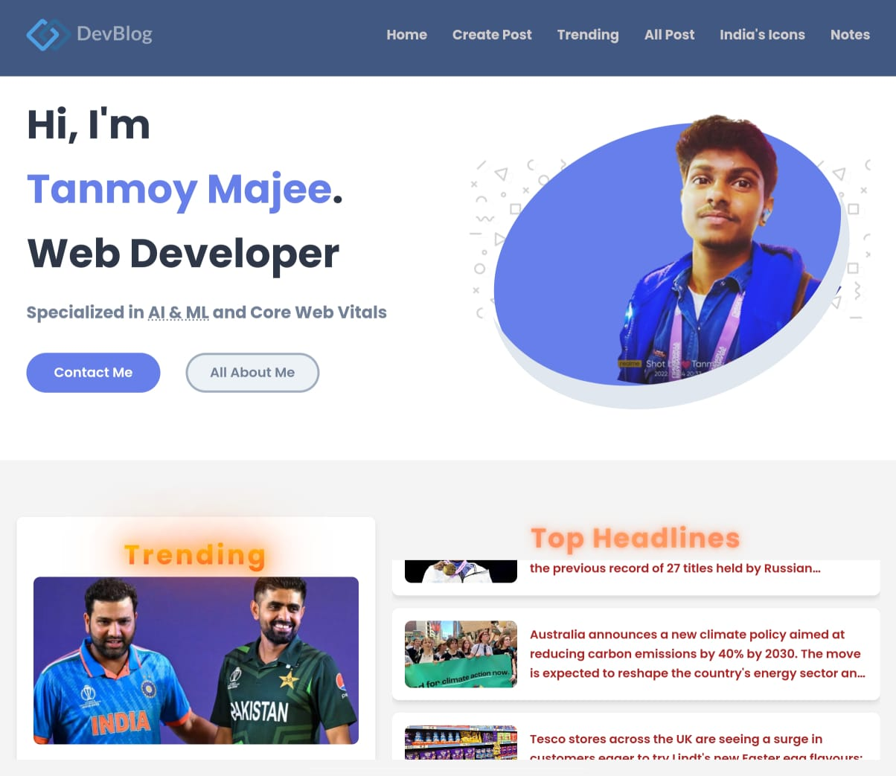
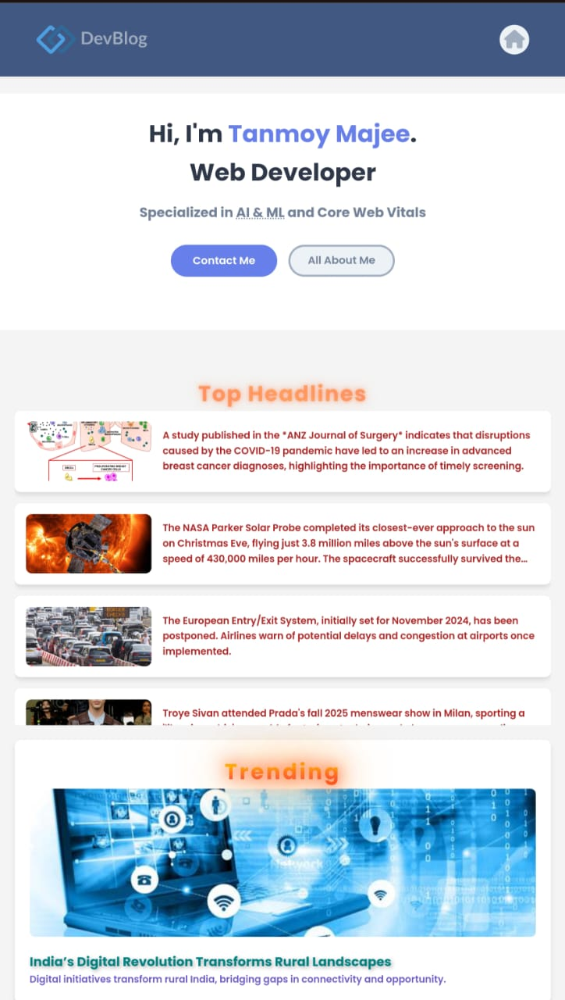

# DevBlog 📝  

*Modern blogging redefined.*

Welcome to **DevBlog**, a modern and dynamic blogging platform that lets users share their ideas, experiences, and knowledge seamlessly. Built with a focus on responsiveness and user experience, DevBlog is designed for developers and writers alike.

---

## 🌟 Features

- **Dynamic Blogging Interface**: Create, edit, and publish blog posts effortlessly.
- **Mobile-First Design**: Fully responsive layout for seamless usability on all devices.
- **Rich Text Editor**: Style your blog posts with headings, lists, links, and more.
- **Tagging System**: Organize your content with custom tags for better discoverability.
- **Image Upload**: Add visual appeal to your blogs with embedded images.

---

## 🛠️ Technologies Used

- **HTML5**: For structuring the content and layout.
- **CSS3**: Enhanced visuals with animations and responsive design.
- **JavaScript**: Dynamic functionalities and interactivity.

---

